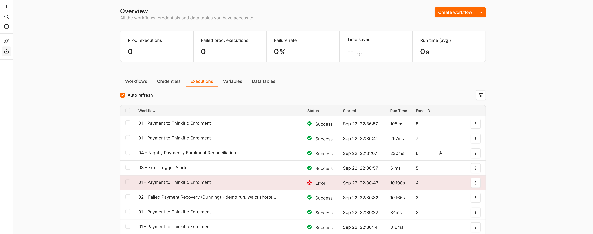
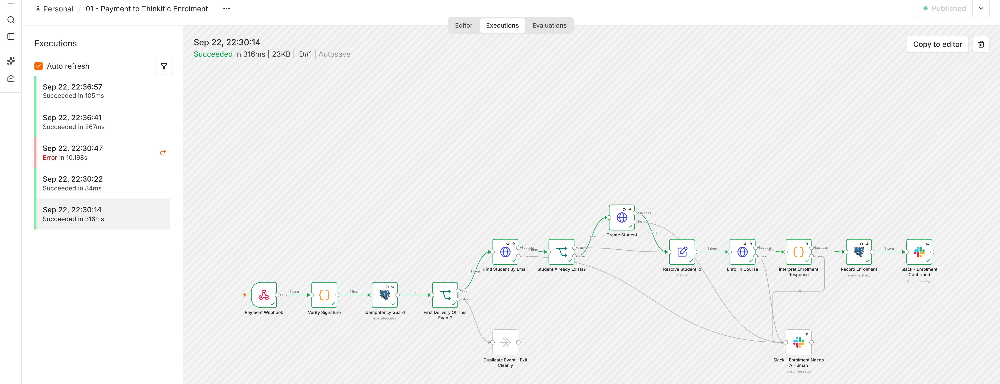
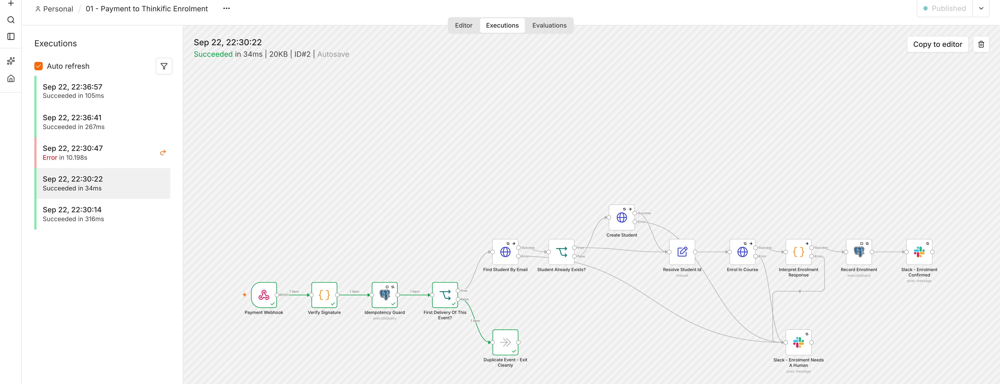
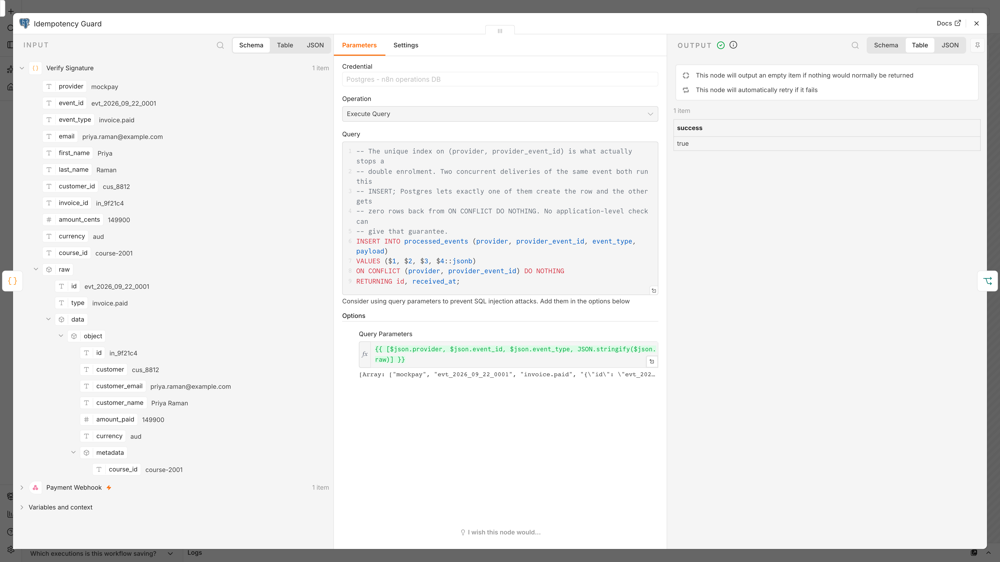
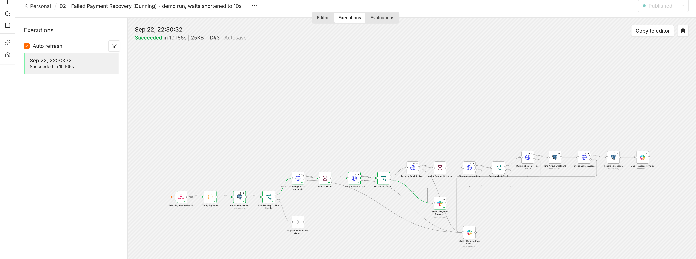
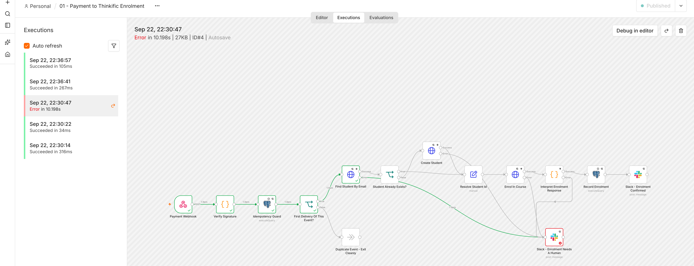
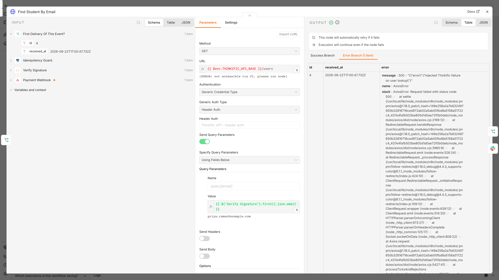
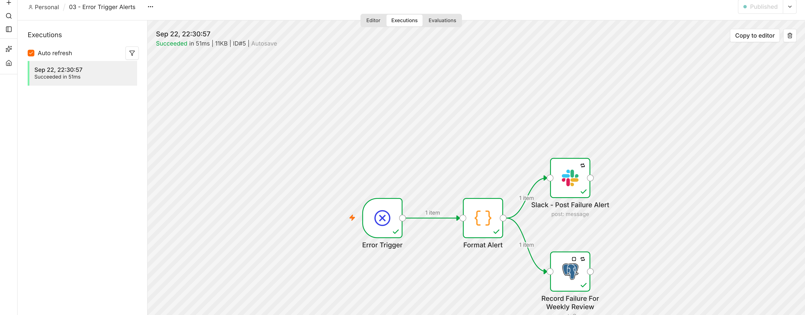
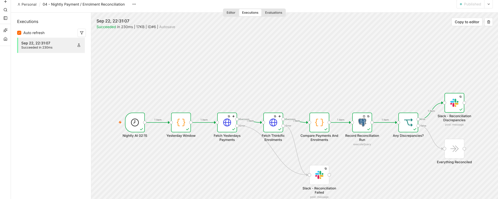

# n8n Revenue Automation Kit

Four importable n8n workflows and the self-hosting setup around them, for the
stack an online education business ends up with when it outgrows Zapier:
payments in, Thinkific access out, Slack for anything a human needs to see, and
a dunning sequence for cards that fail.

**What this is, honestly:** reference workflows I built for exactly this
Zapier → self-hosted n8n migration shape. They are not an export from a private
client account — I do not publish other people's instances. They are meant to be
adapted to your provider, your course ids and your channels rather than dropped
in untouched.

What they are *not* is untested JSON. Everything below is a screenshot of a real
execution in a real n8n 2.40.5 instance, against a real Postgres 17, with the
files in `workflows/` imported unmodified.

---

## Proof: these run

Six executions, one session, execution ids 1–6 in the same instance.



Reproduce the whole thing in about three minutes:

```bash
scripts/demo-up.sh            # n8n + Postgres + a mock provider, in Docker
node scripts/run-scenarios.mjs
node scripts/capture-screenshots.cjs
scripts/demo-down.sh
```

### 1. A payment arrives and the student gets access

`docs/screenshots/01-payment-success.png` — execution #1. Signed webhook →
signature verified → ledger row inserted → student created in Thinkific →
enrolled → enrolment written and the ledger row closed in one statement → Slack.
316 ms end to end.



### 2. The same webhook again — nothing happens twice

This is the screening question: *how do you stop a student being enrolled twice
if a payment webhook fires twice?*

`docs/screenshots/02-duplicate-ignored.png` — execution #2. The identical
payload with the identical provider event id, delivered 8 seconds later. The
green path stops at **Duplicate Event – Exit Cleanly**. Every node on the
Thinkific side is grey: not skipped by a flag, never reached. The execution
finishes green in 34 ms, because a replay is not an error and should not page
anyone.



`docs/screenshots/03-duplicate-guard-zero-rows.png` — the same execution with
the **Idempotency Guard** node open, which is where the guarantee actually
lives. The `ON CONFLICT (provider, provider_event_id) DO NOTHING ... RETURNING`
insert returned **no rows**, so the node emits an empty item (`alwaysOutputData`)
and the IF that reads `$json.id` takes the duplicate branch.



And in the database afterwards — one enrolment row, not two:

```
$ psql -d revenue_ops -c "SELECT provider_event_id, count(*) AS enrolment_rows
                            FROM enrolments GROUP BY 1;"

   provider_event_id   | enrolment_rows
-----------------------+----------------
 evt_2026_09_22_replay |              1
(1 row)
```

`scripts/run-scenarios.mjs` asserts that count on every run, so the claim fails
loudly rather than quietly if anyone changes the guard.

**Video — `docs/duplicate-webhook.mp4`** (57 s): both deliveries fired live
while the executions list is open, then the guard's zero-row output. Nothing in
it is edited; the two HTTP requests are made by the recording script itself.

### 3. Dunning stops the moment the customer pays

`docs/screenshots/04-dunning-stopped-on-payment.png` — a failed-payment webhook
starts the sequence, the hour-0 email goes out, and the invoice is marked paid
while the execution is waiting. At the next checkpoint the re-check reads
`paid`, the sequence leaves by the false branch to **Slack – Payment Recovered**,
and the 24h email, the 72h final notice and the access revocation are never
reached. The mock's outbox contains exactly one message.



The workflow's real intervals are 24h and 48h. This execution is a copy of
`workflows/02-failed-payment-recovery.json` with only the two Wait node
durations changed to 10 seconds and its own webhook path, created by
`scripts/make-dunning-demo.mjs` — the workflow title in the screenshot says so.
Everything else, including the invoice re-check, is the committed file.

### 4. Thinkific returns 500 — retried, then reported

`docs/screenshots/05-thinkific-500-retries.png` — execution #4, the only red one.
The mock was told to fail the Thinkific user lookup. The node retried to its
`maxTries` of 3 (the execution takes 10.198 s for what normally takes 40 ms),
then routed to its error output.



`docs/screenshots/06-thinkific-500-node-error.png` — the same node opened:
*"This node will automatically retry if it fails"*, *"Execution will continue
even if the node fails"*, and the 500 sitting on the **Error Branch**.



### 5. The Error Trigger fires and the failure is written down

For workflow 01 to fail outright, its *own* alerting path has to fail too, so
this scenario takes Slack down for exactly the three attempts the alert node is
allowed. Workflow 01 ends in error, and `docs/screenshots/07-error-trigger-fired.png`
is workflow 03 running off the Error Trigger a moment later: Slack alert and a
row appended to the `failures` table, in parallel.



The ledger row for that event stays at `status = 'received'` — money in, access
not granted — which is exactly what the nightly job is for.

### 6. The nightly reconciliation catches a one-sided payment

`docs/screenshots/08-reconciliation-discrepancy.png` — execution #6, run from
the schedule trigger. Two payments yesterday (in the business timezone, not
UTC), one matching Thinkific enrolment, so one discrepancy:

```
 business_date | payments_checked | enrolments_checked | missing | orphan
---------------+------------------+--------------------+---------+--------
 2026-09-22    |                2 |                  1 |       1 |      0
```



### What running them changed

Executing these instead of only reading them found a real bug, which is the
argument for doing it.

Every node with `onError: continueErrorOutput` also carried
`alwaysOutputData: true`. Those two together do not mean "route errors and also
be safe" — `alwaysOutputData` emits an empty item when a node produces none,
*including when it has just failed*, so a failure travelled down **both**
outputs. In the first recorded outage run, workflow 01 alerted on the failed
Thinkific lookup **and** carried on down the success branch with an empty item:
it created nothing, resolved `user_id` to `0`, enrolled user 0, and wrote a
completed enrolment row for a student who had none. In workflow 02 the same
pattern would have been worse — an invoice check that *errored* would have been
read as "still unpaid" and revoked a paying customer's access.

`alwaysOutputData` is removed from every node that routes its errors.
`test/validate.mjs` now fails on the combination so it cannot come back.

---

## What is mocked in those screenshots, and what is not

Real, in every image above:

- n8n `2.40.5` in Docker, Postgres `17.6`, the compose file in `infra/`.
- The four files in `workflows/`, imported with
  `n8n import:workflow --separate --input=/workflows` and not edited afterwards
  (except credential selection and the error-workflow id, which is what the
  README tells a human to do by hand).
- Real HTTP webhooks with real HMAC-SHA256 signatures over the raw body, and the
  5-minute replay window rejecting anything older.
- The real `ON CONFLICT DO NOTHING` insert against the real unique index in
  `sql/schema.sql`, in a real Postgres.
- n8n's real retry, error-output, Wait, Schedule Trigger and Error Trigger
  behaviour, and the real execution records in n8n's own database.

Mocked, by `mocks/server.mjs` (Node stdlib, no dependencies):

- **The payment provider** — `GET /invoices/:id`, `GET /charges`.
- **Thinkific** — user search and create, enrolment create (including the real
  `422 already enrolled` response), enrolment list, enrolment update.
- **Transactional email** — accepts and records each send.
- **Slack** — `chat.postMessage` and friends.

Two demo-only shortcuts, both in `infra/docker-compose.demo.yml` and nowhere
else:

1. n8n's Slack node has no base-URL setting; it always calls
   `https://slack.com/api`. So the demo maps `slack.com` to the mock
   container's address and sets `NODE_TLS_REJECT_UNAUTHORIZED=0` so the
   self-signed certificate is accepted. The Slack **node** is genuinely
   executing; only the far end is local.
2. The dunning copy described above, with 10-second waits.

Against real services the only thing that changes is the four `*_API_BASE`
environment variables and the credentials — there is nothing mock-shaped inside
the workflow files, and `test/validate.mjs` fails the build on any hard-coded
URL.

---

## Why a webhook firing twice cannot double-enrol

The screenshots show it happening. This is why it is guaranteed rather than
lucky.

**Why check-then-create is not enough.** The obvious guard is: look the event up,
and if you have not seen it, process it. In one n8n worker, at low volume, that
appears to work. It is a race, and the race is lost at exactly the moment you
care about — a burst of traffic, a launch, a provider retrying because your
endpoint was slow.

```
worker A                      worker B
--------                      --------
SELECT ... WHERE event='evt_1'
  -> 0 rows                   SELECT ... WHERE event='evt_1'
                                -> 0 rows          <- B ran before A wrote
enrol the student
INSERT ledger row             enrol the student    <- second enrolment
                              INSERT ledger row
```

Both workers observe "not processed" because neither has written yet. Widening
the SELECT, adding a Redis flag, or checking "is this student already enrolled"
in Thinkific first all have the same shape: a gap between deciding and acting,
into which a second delivery fits. The gap is milliseconds. Payment providers
retry in milliseconds.

**What actually closes it.** In `sql/schema.sql`:

```sql
CONSTRAINT processed_events_provider_event_uniq UNIQUE (provider, provider_event_id)
```

and in the **Idempotency Guard** node, the third node of the workflow:

```sql
INSERT INTO processed_events (provider, provider_event_id, event_type, payload)
VALUES ($1, $2, $3, $4::jsonb)
ON CONFLICT (provider, provider_event_id) DO NOTHING
RETURNING id, received_at;
```

The check and the write are now one statement, adjudicated by Postgres under a
row lock. Two concurrent deliveries both run it; exactly one creates the row and
gets an `id` back. The other gets **zero rows**. There is no interval between
deciding and acting for the second delivery to slip into — that is the whole
difference, and it is not something application logic can reproduce.

**How the workflow reads that.** The Postgres node has `alwaysOutputData: true`,
so a zero-row result still emits one (empty) item rather than ending the branch
silently. The next node, **First Delivery Of This Event?**, is an IF on whether
`$json.id` exists:

- `id` present → first delivery → continue to Thinkific.
- `id` absent → someone else has this event → **Duplicate Event - Exit Cleanly**,
  a No-Op. The execution finishes green.

**The rest of the path is idempotent too**, because the ledger only proves the
*event* is new — it does not prove the downstream calls have not partly run.

- **Find Student By Email** → **Student Already Exists?** → **Create Student**.
  Creation only happens on the branch where the lookup found nothing.
- **Enrol In Course** runs with `neverError` and `fullResponse`, so Thinkific's
  `422` for a repeat enrolment comes back as data instead of throwing.
  **Interpret Enrolment Response** treats `2xx` as `created` and a 422 matching
  `already enrolled` as `already_enrolled` — both successes, because both leave
  the student with access, which was the goal. Anything else throws.
  (`neverError` only suppresses HTTP *status* errors. Timeouts, DNS failures and
  socket resets still throw, so `retryOnFail` on that node is still doing work.)
- **Record Enrolment** writes the enrolment and closes out the ledger row in one
  statement, via a CTE, so a crash between the two cannot leave an event marked
  processed with no enrolment behind it. The enrolment row is itself upserted on
  a unique `provider_event_id`.

**And if it fails anyway.** A failed enrolment leaves `processed_events.status`
at `received`. Workflow 04 reports that as *paid but not enrolled* the same
night — screenshot 8 above is that happening. The guarantee is not "nothing ever
fails". It is that nothing fails silently and nothing is done twice.

---

## Importing the workflows

In n8n: **Workflows → ⋯ → Import from File**, one file at a time. Import `03`
first — the other three reference it as their error workflow.

After importing `03`, copy its workflow id from the URL (`/workflow/<id>`) and
set it in the other three: **⋯ → Settings → Error Workflow**. They ship with the
placeholder `REPLACE_WITH_ERROR_WORKFLOW_ID`, which n8n will not resolve to
anything until you do.

Then create the credentials below and re-select them on each node. Credential
ids are deliberately `null` in these files — an id from my instance would be
meaningless in yours.

`scripts/configure-n8n.mjs` does all of that over the API if you would rather
not click; it is what the proof run uses.

### Credentials

| Credential name in the files | Type | Used by |
|---|---|---|
| `Postgres - n8n operations DB` | Postgres | 01, 02, 03, 04 |
| `Slack - Revenue Bot` | Slack API (bot token, `chat:write`) | all four |
| `Thinkific API - header auth` | Header Auth | 01, 02, 04 |
| `Payment provider API - header auth` | Header Auth | 02, 04 |
| `Transactional email API - header auth` | Header Auth | 02 |

The Postgres credential points at `REVENUE_OPS_DB` (the tables in
`sql/schema.sql`), **not** at n8n's own database.

### Environment variables the workflow expressions read

Every external URL in these files is `{{ $env.SOMETHING }}` rather than a
literal, so the same JSON imports into staging and production unedited. The
validator enforces that — it fails on any hard-coded `http(s)://`.

`PAYMENT_PROVIDER_NAME`, `PAYMENT_API_BASE`, `PAYMENT_WEBHOOK_SECRET`,
`THINKIFIC_API_BASE`, `THINKIFIC_TEMP_PASSWORD`, `DEFAULT_COURSE_ID`,
`EMAIL_API_BASE`, `BILLING_PORTAL_URL`, `SLACK_ENROLMENTS_CHANNEL`,
`SLACK_ALERTS_CHANNEL`, `RECONCILIATION_TIMEZONE`.

All of them are described in `infra/.env.example` and wired through in
`infra/docker-compose.yml`.

Two container settings are **required**, not optional, and are already in the
compose file and in `infra/render.yaml`:

- `NODE_FUNCTION_ALLOW_BUILTIN=crypto` — the signature-verification Code nodes
  `require('crypto')`. Without it they throw on the first line.
- `N8N_BLOCK_ENV_ACCESS_IN_NODE=false` — newer n8n blocks `$env` inside Code
  nodes by default, which would make `$env.PAYMENT_WEBHOOK_SECRET` undefined.

### The workflows

**`01-payment-to-enrolment.json`** — webhook (raw body) → HMAC signature
verification with a 5-minute replay window → idempotency guard → find or create
the Thinkific user → enrol, treating "already enrolled" as success → write the
enrolment and close the ledger row in one statement → Slack confirmation. Every
external call retries three times and routes its error output to a Slack alert
that names the student and the event id.

**`02-failed-payment-recovery.json`** — `payment.failed` webhook → same
verification and same idempotency guard → dunning email at 0h → Wait 24h →
**re-check the invoice** → email at 24h → Wait 48h → **re-check again** → final
notice at 72h → revoke course access → Slack summary. The re-check before each
send is the point: a customer who has already paid drops out of the sequence at
the next checkpoint and is never chased, and never loses access. A *failed*
check routes to the error output and stops — an API error must never be read as
"still unpaid".

The Wait nodes exceed 65 seconds, so n8n takes the execution out of memory and
resumes it from the database later. That requires execution data to be saved
(it is, in the compose file) and it survives a restart — but it does mean a
dunning sequence is a three-day-long execution, which is worth knowing before
you prune aggressively.

**`03-error-trigger-alerts.json`** — Error Trigger → format workflow name,
failing node, error message, execution mode, whether it was a retry, the
execution URL and the item that was in flight → post to Slack and append to
`failures` in Postgres, in parallel. Slack is for the person on shift; the table
is for the Monday review, where you can actually ask which node breaks most
often. This workflow deliberately has **no** error workflow of its own — pointing
it at itself would loop on its own failures.

**`04-nightly-reconciliation.json`** — schedule at 02:15 in the business's
timezone → compute yesterday's window in that timezone (not UTC) → pull
yesterday's successful payments → pull Thinkific enrolments → compare both
directions → upsert one row per business date into `reconciliation_runs` → Slack
only if something does not match. Paid-but-not-enrolled is the expensive case;
enrolled-without-payment is the one that quietly costs you revenue.

---

## Deploying it free

### Render (a blueprint is in the repo)

`infra/render.yaml` is a Render Blueprint: the official n8n image as a web
service, plus a managed Postgres, with every environment variable either wired
from the database, generated once (`N8N_ENCRYPTION_KEY`), or prompted for on
first deploy (`sync: false`, so no vendor secret is ever in this repository).

**Render dashboard → New → Blueprint → select this repository.** Then open the
service URL, create the owner account, import `workflows/`, create the five
credentials, and load `sql/schema.sql` with any psql client using the External
Database URL from the dashboard.

Free tier caveats, stated plainly because they matter for webhooks:

- Free web services **sleep after ~15 minutes idle** and take 30–60 s to wake. A
  payment webhook arriving cold will time out on the provider's first attempt.
  Providers retry, so nothing is lost, but the enrolment is late. Free is for
  evaluating the workflows; the first paid instance removes the sleep.
- Free Postgres **expires after 30 days** and is deleted. Take a dump first.
- Free services have **no persistent disk**. That is survivable here only
  because `DB_TYPE=postgresdb` and the encryption key comes from an environment
  variable, so nothing important lives on the container filesystem.

### Railway

Deploy `docker.n8n.io/n8nio/n8n:2.40.5` as a service, add the Postgres plugin,
and set the same variables: `DB_TYPE=postgresdb` plus the five
`DB_POSTGRESDB_*` values (Railway exposes them as `PGHOST`, `PGPORT`,
`PGDATABASE`, `PGUSER`, `PGPASSWORD` — reference them as `${{Postgres.PGHOST}}`
and so on), `N8N_PORT=${{PORT}}`, `N8N_HOST` and `WEBHOOK_URL` from
`${{RAILWAY_PUBLIC_DOMAIN}}`, `N8N_ENCRYPTION_KEY`, `NODE_FUNCTION_ALLOW_BUILTIN=crypto`,
`N8N_BLOCK_ENV_ACCESS_IN_NODE=false`. Railway's free allowance is a monthly
credit rather than a free instance type: it does not sleep, and it stops when
the credit runs out, which for a webhook endpoint is the worse failure of the
two. Attach a volume at `/home/node/.n8n` if you want the instance to keep
anything outside Postgres.

### Koyeb

Koyeb's free instance runs one web service continuously and does **not** sleep,
which makes it the better free host for webhooks — but it has no managed
Postgres, so point `DB_POSTGRESDB_*` at an external free tier (Neon, Supabase,
Aiven) with `DB_POSTGRESDB_SSL_ENABLED=true`. Deploy the same image, set the
health check to `/healthz` on port 5678, and set `WEBHOOK_URL` to the
`*.koyeb.app` domain. Free instances have a small memory ceiling; the dunning
workflow's multi-day executions are held in Postgres rather than memory, so this
is usually fine, but it is the first thing to check if executions start dying.

### Vercel cannot host n8n

Not "is awkward on" — cannot. n8n is a long-running stateful server: it holds
active trigger and webhook registrations in a process that must stay up, keeps
scheduled and Wait-node executions alive across hours or days, maintains a
connection pool to Postgres, and stores its own state in that database. Vercel
runs serverless functions that are spun up per request, are killed within
seconds, and have no durable local state or background process between
invocations. There is no build of n8n that fits that model, and deploying the
editor as a static site would leave every webhook and every schedule with
nothing listening. Use a host that runs a container: Render, Railway, Koyeb,
Fly, or your own box with `infra/docker-compose.yml`.

---

## Self-hosting

`infra/docker-compose.yml` runs n8n + Postgres + Caddy. Postgres is on an
internal-only Docker network; n8n is not published on a host port at all and is
reachable only through Caddy over HTTPS.

```bash
cd infra
cp .env.example .env          # fill in every value
cp Caddyfile.example Caddyfile
docker compose up -d
docker compose exec -T postgres psql -U "$POSTGRES_USER" -d "$REVENUE_OPS_DB" < ../sql/schema.sql
```

**Postgres, not SQLite.** SQLite is the default and it is fine until it isn't:
one writer at a time, and the failure mode under concurrent webhook load is a
locked database, not a slow one. Queue mode requires Postgres anyway. Moving
later means a migration you will do under pressure; do it on day one instead.
n8n 2.x wants Postgres 17 or newer — on 16 it logs a compatibility warning on
every boot, which is how the pin here ended up at `17.6-alpine`.

**Queue mode when volume needs it, not before.** Commented into the compose file
(Redis + an `n8n-worker` service + `EXECUTIONS_MODE=queue`). The signal to turn
it on is webhook responses queueing behind long executions, or Wait-node
executions blocking throughput. A worker needs the *same* `N8N_ENCRYPTION_KEY`
and the same database as the main instance, or it cannot decrypt the credentials
it is handed.

**Pinned versions.** `n8n:2.40.5`, `postgres:17.6-alpine`, `caddy:2.8-alpine`.
`latest` means an unattended restart can change node behaviour at 3am. Upgrade
deliberately, on staging first, after reading the release notes for node version
bumps.

**Staging.** The same compose file on a second host with its own `.env`, its own
encryption key, and sandbox API keys. Because every endpoint is `{{ $env.X }}`,
promoting a workflow is an import — no node parameters to edit and forget.

**Pruning.** `EXECUTIONS_DATA_PRUNE=true` with a 14-day age limit and a 50,000
execution ceiling. Without it the execution tables grow without bound and what
takes the business down is the disk, not the workflow.

**Backups, with a restore you have actually run.** `infra/backup.sh` writes a
dated archive containing `pg_dump -Fc` of both databases, a tar of the n8n data
volume, a copy of `.env` (because `N8N_ENCRYPTION_KEY` is what makes the
credentials in the dump readable again), and a MANIFEST with checksums. It fails
loudly on a zero-byte dump and prunes archives older than
`BACKUP_RETENTION_DAYS`.

```
15 3 * * * /opt/n8n/infra/backup.sh >> /var/log/n8n-backup.log 2>&1
```

`infra/restore.sh <archive> [--yes]` unpacks it, warns you if the encryption key
in the backup differs from the one in your current `.env`, drops and recreates
both databases, restores the volume, and prints the four checks that tell you
the restore actually worked. Run it on a scratch host monthly. The two things
that go wrong are always the same: a missing encryption key, so every credential
comes back as unreadable ciphertext, and a dump that has been zero bytes for six
weeks.

---

## Running the proof yourself

```
mocks/       payment provider, Thinkific, email and Slack stand-ins (stdlib only)
scripts/     bring the stack up, configure it, run the scenarios, capture proof
docs/        screenshots and the duplicate-webhook video
```

```bash
scripts/demo-up.sh                    # docker compose + schema + import + credentials
node scripts/run-scenarios.mjs        # the five scenarios, with assertions
node scripts/capture-screenshots.cjs  # docs/screenshots/*.png (needs playwright)
node scripts/record-duplicate-video.cjs   # docs/duplicate-webhook.mp4 (needs ffmpeg)
scripts/demo-down.sh                  # remove the containers and volumes
```

`infra/.env.demo` holds the values for that local run. Everything in it points
at localhost or at the mock container; none of it is a credential for any real
service, and the production compose file does not read it.

The scenario script asserts, not narrates. It fails if the duplicate delivery
produces a second enrolment row, if the dunning sequence sends an email after
the invoice is paid, if the Thinkific call is not retried three times, if the
Error Trigger does not write a `failures` row, or if the reconciliation misses
the seeded one-sided payment.

---

## What I would change on day one in your stack

1. **Set the error workflow globally**, not per workflow. n8n has a default error
   workflow setting for the instance; per-workflow settings are one checkbox
   away from being forgotten on the next workflow someone builds.
2. **Retries on every external call.** Zapier gives you nothing here. Three
   tries with a few seconds between them removes most of the noise that
   currently looks like "the integration is flaky".
3. **A reconciliation job from the start.** Webhooks are best-effort. Until
   something compares the payment ledger to the access system nightly, the first
   report of a missed enrolment is a refund request.
4. **Alert on silence, not only on errors.** A workflow that stopped being
   triggered raises nothing. Alert when the nightly reconciliation has not
   written a row for yesterday, and when `processed_events` has rows sitting at
   `received` for more than fifteen minutes — those are the failures that do not
   announce themselves.
5. **Move the Zapier Zaps over one revenue path at a time**, running both in
   parallel with the n8n side writing to Postgres but not yet acting, until the
   ledgers agree for a week.

---

## Validating before you import

```bash
node --test test/validate.mjs
```

Checks every file for: valid JSON; the fields n8n requires on each node; unique
node names and ids; every connection target existing; exactly one trigger and no
unreachable nodes; `retryOnFail`, `maxTries`, `waitBetweenTries` and a wired
error output on every HTTP Request; no node combining `alwaysOutputData` with
`continueErrorOutput`; `executionOrder: v1` and an error workflow (except on
`03`); credential ids left null; no secret-shaped strings; no hard-coded URLs;
unique webhook paths across the kit; and that the idempotency guard is still an
`ON CONFLICT DO NOTHING ... RETURNING` insert rather than a SELECT someone
quietly replaced it with.

---

Built by **Lekhraj Saini**.
